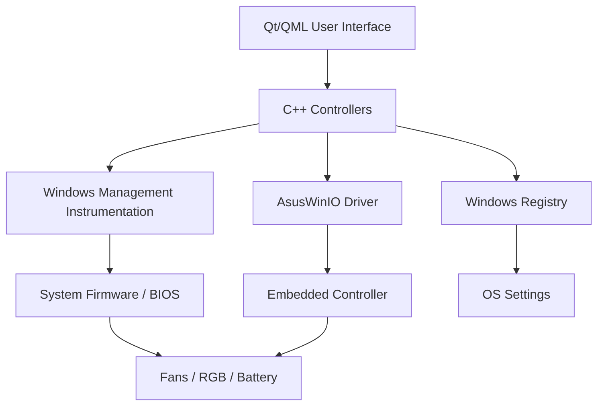

<div align="center">

# 🎮 ASUS TUF Fan Control (Windows)


**The Ultimate System Control Center for ASUS Gaming Laptops on Windows**

*A lightweight, open-source alternative to Armoury Crate & G-Helper*

</div>

---

## 📸 Visual Tour

<table>
  <tr>
    <td></td>
    <td></td>
  </tr>
  <tr>
    <td align="center"><b>🚀 System Dashboard</b><br>Real-time stats monitoring</td>
    <td align="center"><b>Unknown Fan Control</b><br>Silent / Balanced / Turbo Modes</td>
  </tr>
  <tr>
    <td></td>
    <td></td>
  </tr>
  <tr>
    <td align="center"><b>💡 Aura Sync RGB</b><br>Static, Breathing, Strobing Effects</td>
    <td align="center"><b>🔋 Battery Health</b><br>Limit Charge to 60/80%</td>
  </tr>
   <tr>
    <td colspan="2" align="center"></td>
  </tr>
  <tr>
    <td colspan="2" align="center"><b>⚙️ Advanced Settings</b><br>Language, Theme & Configuration</td>
  </tr>
</table>

---

## ✨ Key Features

### 🌀 Advanced Fan Control
- **Presets:** Instantly switch between **Silent**, **Balanced**, and **Turbo** modes.
- **Max RPM Mode:** Unlock the full potential of your fans (~6000 RPM) for extreme cooling.
- **Custom Curves:** (Coming Soon) Define your own temperature-to-speed mapping.
- **Visual Feedback:** Animated fan indicators responding to real-time speed.

### 🔋 Intelligent Battery Health
- **Charge Limiting:** Set a hard limit (e.g., **60%** or **80%**) to extend battery lifespan.
- **Persistence:** Limits act at the firmware level and persist reboots.
- **Smart Monitoring:** Accurate charging/discharging status display.
- **Safety Checks:** Periodically enforces limits to prevent Windows overriding settings.

### 💡 Aura Sync RGB Control
- **Effects:** Access built-in keyboard effects:
  - **Static:** Solid color of your choice.
  - **Breathing:** Pulse effect with speed control.
  - **Strobing:** Flash effect for alerts.
  - **Rainbow:** Cycling colors (4-zone RGB support).
- **Customization:** Fine-tune brightness, speed, and color using a visual picker.

### 📊 Comprehensive Dashboard
- **Real-Time Monitoring:**
    - **CPU:** Usage, Temperature, Frequency.
    - **GPU:** Detected dynamically (supports NVIDIA Optimus/Sleep states).
    - **RAM & Disk:** Usage statistics.
    - **Network:** Live Upload/Download speeds.
- **Hardware Info:** Detects Laptop Model, CPU Model, and specific GPU variant (e.g., RTX 3050).

### 🌍 Global Language Support
- **22 Languages Supported:**
  - 🇺🇸 English
  - 🇮🇳 Tamil, Hindi, Bengali, Marathi, Punjabi, Urdu
  - 🇪🇸 Spanish, 🇫🇷 French, 🇩🇪 German, 🇮🇹 Italian, 🇵🇹 Portuguese
  - 🇨🇳 Chinese, 🇯🇵 Japanese, 🇰🇷 Korean
  - 🇷🇺 Russian, 🇹🇷 Turkish, 🇸🇦 Arabic (RTL Support)
  - And more (Indonesian, Polish, Swahili, Persian, Vietnamese)!
- **Instant Switching:** Change languages on the fly without restarting the app.

### 🎨 Modern UI/UX
- **Glassmorphism:** Sleek, translucent design that blends with Windows 11.
- **Responsive Sidebar:** Collapsible navigation for a cleaner look.
- **Theme Support:** Toggle between Dark and Light modes.

---

## 🛠️ Architecture

This application bridges the gap between high-level UI and low-level hardware control:



- **WMI Wrapper:** Handles standard calls for Fan Modes and RGB.
- **AsusWinIO:** Direct memory access to the EC for reading fan speeds and forcing max RPM.
- **Registry:** Stores persistent user preferences and battery limits.

---

## 📋 Requirements

| Component | Requirement |
|-----------|-------------|
| **OS** | Windows 10 or Windows 11 (64-bit) |
| **Privileges** | **Administrator** (Required for hardware access) |
| **Driver** | ASUS System Control Interface (v3+) |
| **Hardware** | ASUS TUF / ROG Gaming Laptops |

---

## 📥 Installation

1.  **Download:** Get the latest release from the [Releases Page](../../releases).
2.  **Run:** Extract the zip file and run `AsusTufFanControl_Windows.exe` as **Administrator**.
    - *Note: If asked, allow the application to make changes to your device.*

---

## 🏗️ Building from Source

### Prerequisites
- **Qt 6.6+** (MSVC 2019 64-bit or newer)
- **Visual Studio 2022** (C++ Desktop Development workload)
- **CMake 3.16+**

### Steps
1.  **Clone the Repository:**
    ```bash
    git clone https://github.com/Karthigaiselvam-R-official/AsusTufFanControl_Windows.git
    cd AsusTufFanControl_Windows
    ```

2.  **Configure & Build:**
    ```bash
    mkdir build && cd build
    cmake ..
    cmake --build . --config Release
    ```

3.  **Run:**
    The executable will be located in `build/Release/`.

---

## 👥 Credits & Acknowledgements

- **Author:** [Karthigaiselvam R](https://github.com/Karthigaiselvam-R-official)
- **Inspiration:** G-Helper, Armoury Crate
- **Libraries:** Qt6, WinAPI

---

## 📄 License

This project is licensed under the **GNU General Public License v3.0**.
Free to use, modify, and distribute. No warranty provided.

<div align="center">

**Made with ❤️ for the ASUS Community**
⭐ Star this repository if you find it useful!

</div>
