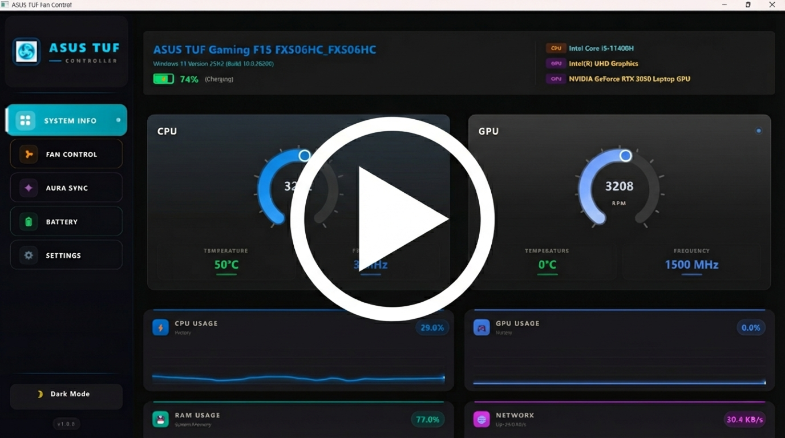
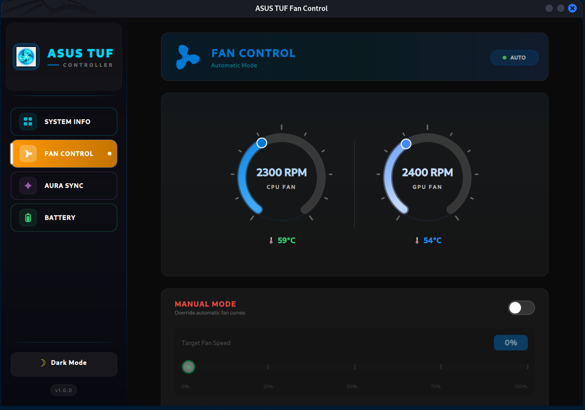
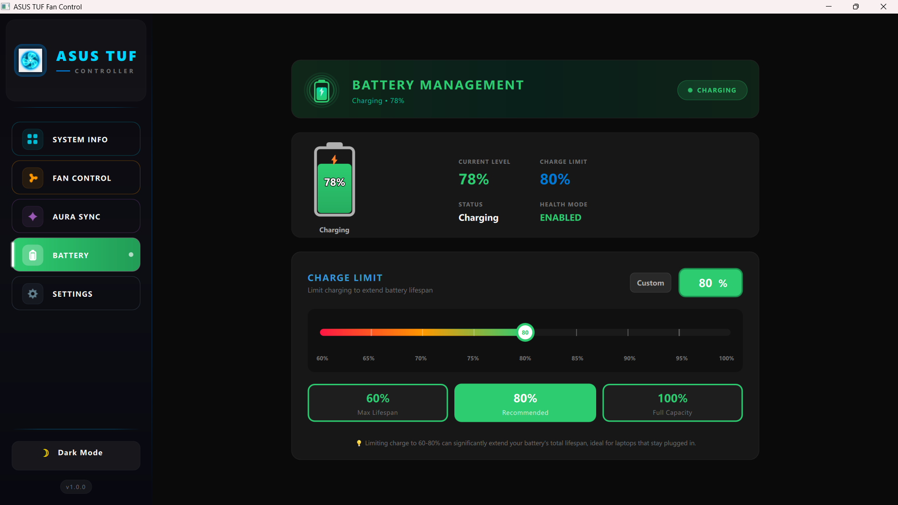
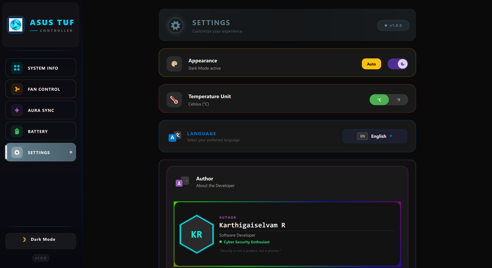
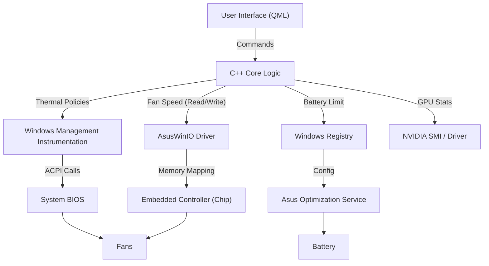

<div align="center">

# 🎮 ASUS TUF Controller (Windows Edition)


**The Ultimate System Control Center for ASUS Gaming Laptops**
*Native. Lightweight. Powerful.*

<p align="center">
  <a href="https://drive.google.com/file/d/1gzrBFWGWBN8fweB-L-DPERvdoOlELrUA/view?usp=sharing">
    
    <br>
    
    <br>
    <b>Click image or badge to watch the full demo</b>
  </a>
</p>

[](https://github.com/Karthigaiselvam-R-official/AsusTufController_Windows/releases/download/v1.0.0/AsusTufController_v1.0.0.zip)

[✨ Features](#-features) • [🛠️ How It Works](#--architecture--under-the-hood) • [💬 Discord](#)

</div>

---

## 📖 Introduction

**AsusTufController** is a custom-built, open-source control center designed specifically for ASUS TUF and ROG gaming laptops. Frustrated by the bloatware of *Armoury Crate* and the limitations of generic tools, this project aims to provide a **native, resource-efficient** alternative that gives you full control over your hardware.

Built with **C++ and Qt 6**, it runs with minimal background usage while unlocking features often hidden by the manufacturer, such as precise fan control, battery charge limiting, and custom RGB lighting effects.

### 🚀 Why use this over Armoury Crate?

| Feature | ASUS Armoury Crate | AsusTufController |
| :--- | :---: | :---: |
| **Resource Usage** | 🔴 Heavy (Hundreds of MBs RAM) | 🟢 **Ultra-Light (<50MB)** |
| **Boot Time** | 🔴 Slows down startup | 🟢 **Instant Launch** |
| **UI/UX** | 🔴 Cluttered, Slow, Ads | 🟢 **Clean, Glassmorphic, No Ads** |
| **Privacy** | 🔴 Telemetry & Data Collection | 🟢 **100% Offline & Open Source** |
| **Fan Control** | 🟡 Basic Presets | 🟢 **Advanced (Max RPM/Custom)** |
| **Battery Limit** | 🟡 Sometimes resets | 🟢 **Enforced & Persistent** |

---

## 📸 Visual Tour & Features

### 1. 🚀 Next-Gen Fan Control
Take control of your thermals. Unlike standard tools that just offer "Silent", we give you the raw power of the hardware.

<table>
  <tr>
    <td width="60%"></td>
    <td>
      <h3>🌀 Operational Modes</h3>
      <ul>
        <li><b>🔇 Silent Mode:</b> Optimizes CPU logic for passive cooling. Fans turn off completely below 50°C.</li>
        <li><b>⚖️ Balanced Mode:</b> The sweet spot between performance and acoustics. Perfect for daily tasks.</li>
        <li><b>🚀 Turbo Mode:</b> Aggressive cooling curve for gaming. Prioritizes low temps over noise.</li>
        <li><b>🌪️ MAX RPM Injection (New):</b> <br>
        Bypasses standard limits to force fans to <b>100% (approx 6800 RPM)</b>. Essential for benchmarking or extreme overclocking. Uses direct EC (Embedded Controller) writes via <code>AsusWinIO</code>.</li>
      </ul>
    </td>
  </tr>
</table>

### 2. 🌈 Aura Sync RGB Lighting
Your keyboard, your style. No heavy background services required.

<table>
  <tr>
    <td>
      <h3>💡 Lighting Effects</h3>
      <ul>
        <li><b>Static:</b> Choose any specific color from a full RGB palette.</li>
        <li><b>Breathing:</b> A smooth, rhythmic pulse of light. Adjust speed and brightness.</li>
        <li><b>Strobing:</b> Fast flashing effect for maximum visibility/alert.</li>
        <li><b>Rainbow:</b> (Soak Test) A localized hardware effect that cycles through the spectrum.</li>
      </ul>
      <p><i>Note: Supports 4-Zone RGB and Single-Zone RGB keyboards automatically.</i></p>
    </td>
    <td width="60%"></td>
  </tr>
</table>

### 3. 🔋 Intelligent Battery Health
Protect your investment. Lithium-ion batteries degrade when kept at 100% charge.

<table>
  <tr>
    <td width="60%"></td>
    <td>
      <h3>🛡️ Charge Limiting</h3>
      <ul>
        <li><b>60% Mode:</b> Best for "Always Plugged In" usage. Maximizes long-term battery lifespan.</li>
        <li><b>80% Mode:</b> Good balance for mixed usage.</li>
        <li><b>100% Mode:</b> For travel days when you need max capacity.</li>
      </ul>
      <h3>⚡ Smart Enforcement</h3>
      <p>Windows updates or BIOS resets often wipe these settings. Our <b>Enforcement Engine</b> checks the limit every 200ms and reapplies it instantly if tampered with, ensuring your battery <i>stays</i> protected.</p>
    </td>
  </tr>
</table>

### 4. ⚙️ Settings & Localization
A truly global application, designed for everyone.

<p align="center">
  
</p>


> **Note:** This project is currently in **Stable Release v1.0.0**.

*   **23 Languages Supported:** From Tamil to Japanese, Arabic (RTL), English, and more.
*   **Theme Engine:** Seamlessly switch between Dark Mode (OLED friendly) and Light Mode.
*   **Auto-Start:** Option to launch silently to tray on Windows boot.

---

## 🛠️ Supported Hardware

This application is designed to work on **all modern ASUS Gaming Laptops** (2020+).

| Series | Models |
| :--- | :--- |
| **TUF Gaming** | F15, F17, A15, A17, Dash F15, FX506, FX507, FA506, FA507 |
| **ROG Strix** | G15, G17, Scar 15, Scar 17, G513, G713, G533, G733 |
| **ROG Zephyrus** | G14, G15, M15, M16, Duo 15/16 |
| **ROG Flow** | X13, X16, Z13 |
| **Professional** | **Vivobook, Zenbook, ProArt** (Fan/Battery control supported) |

### 🧠 Processors & Graphics
| Component | Support |
| :--- | :--- |
| **Intel Core** | i5, i7, i9 (10th Gen+) |
| **AMD Ryzen** | Ryzen 4000, 5000, 6000, 7000 Series |
| **NVIDIA GeForce** | GTX 1650/Ti, RTX 30/40 Series (Full Telemetry Support) |
| **AMD Radeon** | RX 6000/7000 Series (Universal Usage Monitoring) |
| **Intel Arc** | A-Series Mobile Graphics (Universal Usage Monitoring) |

*If you have the "ASUS System Control Interface" driver installed, it will likely work!*

### ⚠️ Hardware Specifics & Limitations

1.  **Single-Fan Laptops (e.g., TUF Dash F15, Vivobook):**
    *   Fully supported! The application will correctly control your single CPU fan.
    *   The second fan gauge (GPU) will simply show **0 RPM** or appear inactive. This is expected behavior as the hardware does not exist.

2.  **No RGB / White-Only Backlight:**
    *   **White-Only Keyboards:** Brightness control works perfectly.
    *   **No Backlight / Non-RGB:** If your laptop does not have RGB hardware, **kindly ignore the Aura Sync section entirely.**
    *   *Please do not waste time trying to change colors on hardware that supports only white (or no) light. The application cannot force hardware to do what it physically cannot do.*

---

## 🏗️ Architecture & Under the Hood

How does it work without ASUS services? By talking directly to the metal.



### The Technology Stack
*   **Language:** C++17 (Performance critical code)
*   **UI Framework:** Qt 6.8 / QML (Hardware accelerated GPU rendering)
*   **Build System:** CMake + MSVC
*   **Interfacing:**
    *   `AsusWinIO64.dll`: Used to map physical memory and read EC registers directly.
    *   `DeviceIoControl`: Sends IOCTL codes to the ACPI driver.
    *   `nvidia-smi`: Spawns lightweight processes to query GPU sleep states/clocks.

---

## 📥 Installation Guide

### Option 1: Binary (Recommended)
1.  ## Download
Get the latest version from the [Releases](https://github.com/Karthigaiselvam-R-official/AsusTufController_Windows/releases) page.

**Latest Version:** [v1.0.0](https://github.com/Karthigaiselvam-R-official/AsusTufController_Windows/releases/download/v1.0.0/AsusTufController_v1.0.0.zip)**.
2.  Extract the folder to a permanent location (e.g., `C:\Program Files\AsusTufController`).

3.  **🚀 Primary Launch Method:**  
    > [!IMPORTANT]
    > **Always launch via `run.bat` for full control!**  
    >   
    > This script automatically requests **Administrator** privileges and uses **PsExec** to launch the software as a **SYSTEM** service. This is strictly required to bypass firmware locks on fan speeds and battery limits.  
    > *Ensure `AsusWinIO64.dll` is in the same folder.*

4.  **Alternative Launch Method:**  
    Right-click `AsusTufController_Windows.exe` and select **"Run as Administrator"**.  
    *   *Note: This may have limited control over certain hardware registers compared to the `run.bat` method.*

---

## ⚠️ Troubleshooting Installation (Smart App Control)

If you see a popup saying **"Smart App Control blocked a file that may be unsafe"** or **"Windows protected your PC"**:

This happens because the app is not digitally signed (which costs $400+/year). Windows blocks it by default.

### ✅ **The Fix (Do this BEFORE extracting):**
1.  **Delete** the folder you just extracted.
2.  **Right-click** on the downloaded `AsusTufController_v1.0.0.zip`.
3.  Select **Properties**.
4.  At the bottom, check the **"Unblock"** box.
5.  Click **Apply** -> **OK**.
6.  **Extract the zip again.**

### � **STILL BLOCKED? Do this for specific files:**
If unblocking the zip didn't work, you **MUST** unblock these 3 files individually:

> [!WARNING]
> **You cannot run the app until these files are unblocked!**

1.  Right-click `run.bat` ➡️ **Properties** ➡️ Check **"Unblock"** ➡️ **OK**
2.  Right-click `AsusTufController_Windows.exe` ➡️ **Properties** ➡️ Check **"Unblock"** ➡️ **OK**
3.  Right-click `PsExec.exe` ➡️ **Properties** ➡️ Check **"Unblock"** ➡️ **OK**

**Then try running `run.bat` again.**

Now `run.bat` will work perfectly! 🚀

---

### Option 2: Build from Source
Perfect for developers who want to contribute.

**Prerequisites:**
*   **Visual Studio 2022** (with "Desktop development with C++" workload).
*   **Qt 6.8.3+** (MSVC 2022 64-bit component).
*   **CMake 3.20+**.
*   **Git**.

**Steps:**
1.  **Clone the Repo:**
    ```powershell
    git clone https://github.com/Karthigaiselvam-R-official/AsusTufController_Windows.git
    cd AsusTufController_Windows
    ```

2.  **Generate Project:**
    ```powershell
    mkdir build
    cd build
    cmake ..
    ```

3.  **Compile:**
    ```powershell
    cmake --build . --config Release
    ```

4.  **🚀 Run (Full Power):**
    > [!IMPORTANT]
    > **To unlock full hardware power when building from source:**
    > 1. Copy **`run.bat`**, **`PsExec.exe`**, and **`AsusWinIO64.dll`** from the root directory into `build/Release/`.
    > 2.   
    > 3. Run **`run.bat`** from the `build/Release/` folder.
    >
    > *This is strictly required to gain **SYSTEM** privileges for direct EC/WMI communication.*

---

## ❓ Troubleshooting & FAQ

**Q: The app doesn't open / crashes immediately.**
*   **A:** Ensure you removed the zip file restriction. Right-click Zip -> Properties -> Unblock. Also, verify you have the *ASUS System Control Interface* driver installed (check Device Manager -> System Devices).

**Q: Fan Control isn't working / Fans are stuck.**
*   **A:** Some newer 2024/2025 models use a different ACPI interface. Check the `logs/` folder for "WMI Error" codes. Try restarting the app as Administrator.

**Q: I set a battery limit (e.g., 85%) but it keeps charging past it?**
*   **A:** This usually means your **Battery Health** is degraded. If your *current maximum capacity* is much lower than the *original design capacity*, Windows may force the battery to charge to 100% of its *remaining* life to keep the laptop usable.
    *   **Diagnostic:** Open Terminal and run: `powercfg /batteryreport`
    *   Open the generated HTML report. Compare **Design Capacity** vs **Full Charge Capacity**. If the gap is large, the firmware is likely overriding your limit.

**Q: Does this void my warranty?**
*   **A:** No software can void hardware warranties typically, but **use at your own risk**. Forcing fans to 0% while gaming *will* cause overheating. The app has fail-safes, but common sense is required.

---

## 🌍 Global Localization

This project is built for a global audience, with **23 languages** fully supported and manually localized by the author to ensure technical accuracy:

*   **Arabic (العربية)**
*   **Bengali (বাংলা)**
*   **Chinese (中文)**
*   **French (Français)**
*   **German (Deutsch)**
*   **Hindi (हिन्दी)**
*   **Indonesian (Bahasa Indonesia)**
*   **Italian (Italiano)**
*   **Japanese (日本語)**
*   **Korean (한국어)**
*   **Marathi (मराठी)**
*   **Persian (فارسی)**
*   **Polish (Polski)**
*   **Portuguese (Português)**
*   **Punjabi (ਪੰਜਾਬੀ)**
*   **Russian (Русский)**
*   **Spanish (Español)**
*   **Swahili (Kiswahili)**
*   **Tamil (தமிழ்)**
*   **Turkish (Türkçe)**
*   **Urdu (اردو)**
*   **Vietnamese (Tiếng Việt)**
*   **English**

---

## 👤 Author & Support

<div align="center">

**Karthigaiselvam R**

[](mailto:karthigaiselvamr.cs2022@gmail.com)
[](https://www.linkedin.com/in/karthigaiselvam-r-7b9197258/)
[](https://github.com/Karthigaiselvam-R-official)

</div>

---

## 📄 License

This software is provided under the **GNU General Public License v3.0 (GPL-3.0)**.

*   You are free to use, modify, and distribute this software.
*   You may **NOT** sell this software (commercial use restriction applies under Commons Clause if applicable).
*   Source code must remain open.

Copyright © 2024-2026 Karthigaiselvam R. All Rights Reserved.

---

<div align="center">

**Made with ❤️ for ASUS TUF Gaming Laptop users facing heating issues**

</div>
